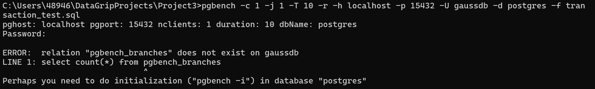
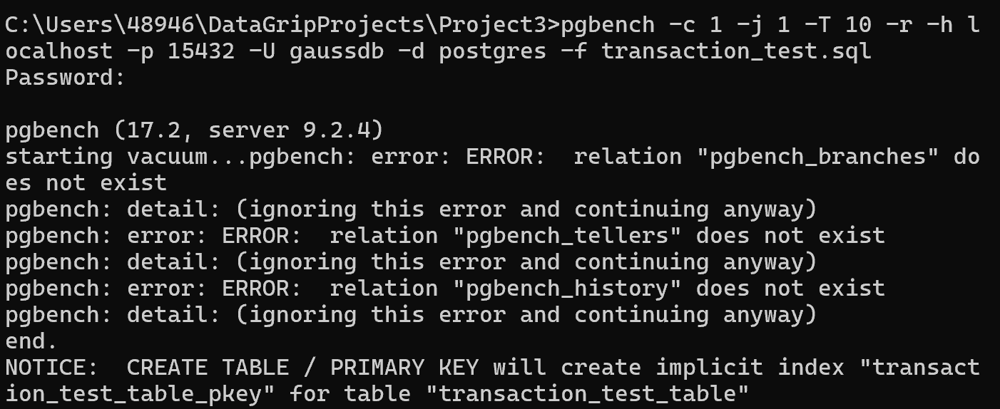

# DB-Project3仓库简介
该仓库为南方科技大学CS213**数据库原理**(H)课程的Project3项目文件仓库。  
目录下/sql文件夹中包含测试所用到的sql脚本文件，  
    /initial_data_from_cmd 文件夹中包含通过运行pgbench进行测试所得到的输出数据。  
    /report 文件夹中包含项目报告的pdf文件，**由于格式限制，可以下拉到本地后用本地pdf阅读器阅读**。  
    /datasets 文件夹中包含项目实验中用到的数据集。  
    **如有疑问，可联系12311153@mail.sustech.edu.cn**

# 项目内容介绍

**openGauss** 是华为公司开发的开源关系型数据库管理系统 （RDBMS）。它专为企业级应用程序而设计，基于PostgreSQL，具有专为高性能、可靠性和安全性量身定制的增强功能。据称，openGauss 特别适用于复杂的数据密集型场景，例如金融系统、电信和大型电子商务平台。

**本实验旨在通过对比PostgreSQL和openGauss的性能探讨和评估 openGauss 的实际应用性能。**

# pgbench测试工具

## pgbench简介：
pgbench 是 PostgreSQL 自带的一个基准测试工具， 用于评估数据库的性能。它通过模拟多个并发的数据库会话，反复执行一系列预定义或自定义的 SQL 命令，从而计算事务执行的平均速率（每秒执行的事务个数）。在终端调用pgbench 利用多客户端、多线程执行 SQL 脚本后， pgbench 将会输出每个客户端的事务数、实际处理的事务数、平均延迟时间和每秒的事务数等，能够帮助我恩了解数 据库的性能表现。由于 openGauss 也是基于 PostgreSQL 开发并同时兼容 pgbench，因此 pgbench 非常支持该实验 用来测试 PostgreSQL 和 openGauss 数据库的并发量、吞吐量、延迟等性能指标。

- [在docker上安装Postgres及openGauss](./docx/project3-openGaussGuideline.pdf)
> Reference: CS213课程助教 Ziyang Zhang
#### 注意：
- 若docker容器无法正常运行：删掉容器，并尝试将openGauss的image版本改为3.0.0后重复先前操作。
- 注意文件路径最好不要包含中文、空格。
- 注意openGauss的密码要求：需要包含大小写、数字、特殊字符（建议使用!或@）

## 配置pgbench
### 0.**环境配置**  
Postgres的安装包中已带有pgbench工具，在终端运行pgbench，首先需要将Postgres加入环境配置。以Windows11操作系统为例，步骤为：
    1）	win+r打开运行对话框，输入sysdm.cpl，回车后进入系统属性界面
    2）	点击“高级”页面下面的“环境变量”
    3）	点击系统变量下的Path后点击编辑，点击浏览，找到PostgreSQL的文件夹下的bin文件夹，加入到环境变量并确认。

### 1.**初始化**  

    pgbench -i -h [主机名] -p [端口] -U [用户名称] -d [数据库名称] 
其中，-i -- initialize 表示对资料库初始化  
-p -- port 指代数据库连接的端口  
-h -- host 指代数据库连接的主机  
-U -- User 指代连接数据库时登录的用户，输入的密码也应当是该用户的对应密码（PostgreSQL默认为postgres；openGauss默认为gaussdb）  
-d -- database 指代数据库名称（两者均默认为postgres）

以本人在本地测试为例：  
> （在PostgreSQL中进行初始化）pgbench -i -h localhost -p 5432 -U postgres -d postgres  
> （在openGauss中进行初始化）pgbench -h localhost -p 15432 -U gaussdb -d postgres -i

回车确认后，需要输入用户密码进行操作。

#### 可能遇到的问题
在本人进行初始化过程中，发现出现过以下报错
- 找不到pgbench_branches

此时注意-i 命令应当在其他命令符前面，pgbench的后面，初始化成功结果如下  

  

- openGauss连接失败

此时注意不同于PostgreSQL，-i 命令符应当在端口（-p）后  

- “tid”列名冲突

这是由于“tid”在openGauss中被设置为了系统保留字，想要直接解决难度复杂度均较大。此时我们选用的解决方式为，直接运行测试命令，发现不会影响后续的测试操作。

### 2. 测试脚本  
在本仓库的/sql目录下有该实验中所用到的sql脚本，其中可以通过注释行来利用同一脚本对各种类型的操作进行测试。若想要自行设计sql脚本进行测试，可以在Datagrip或任一sql编辑器中新建.sql文件，并编写相关SQL语句。  

#### 测试对应脚本

|脚本名称.sql|对应实验|
|:-:|:-:|
|insert_test|数据导入速度|
|query_test|查询性能、连接能力|
|transaction_test|并发处理能力、效率与资源使用率|

### 3.测试命令
**首先，我们需要将终端切换到脚本文件所在的本地目录下。**
接着，可以输入以下格式命令： 

    pgbench -c [客户端数目] -j [并发线程数] -T[运行总时长] -h [主机名] -p [端口] -U [用户名称] -d [数据库名称] -f [测试脚本文件名]
其中，-c --client 表示客户端数目  
-j --jobs 表示并发时的线程数
-T --Time 表示运行的总时长（秒）
-f --file 表示该测试运行的脚本名称
-r --report 表示输出脚本中每一条语句的执行延迟
在实验中也可以用-t来指定每个客户端发出的事务数，但注意-t 和-T 不能同时使用。
其余相关的命令符，可以参照[PostgreSQL使用手册](https://docs.postgresql.tw/reference/client-applications/pgbench#yu-fa)

例如，在并发处理能力测试时，本人所使用的命令行如下：

    pgbench -c 100 -j 64 -T 600 -r -h localhost -p 15432 -U gaussdb -d postgres -f transaction_test.sql
表示在客户端数目为100，线程数为64，总运行时长为600秒，运行脚本"transaction_test.sql"所进行的测试。测试结束后，pgbench将会自动输出以下结果：

    transaction type: transaction_test.sql
    scaling factor: 1
    query mode: simple
    number of clients: 100
    number of threads: 64
    maximum number of tries: 1
    duration: 600 s
    number of transactions actually processed: 898 <--实际完成的总事务数
    number of failed transactions: 0 (0.000%) <--失败的事务数
    latency average = 66865.470 ms <--平均延迟
    initial connection time = 327.265 ms <--初始连接时长
    tps = 1.495540 (without initial connection time) <--吞吐量（平均交易完成量）
    statement latencies in milliseconds and failures:<--每条语句的执行延迟时长（毫秒）
            21.834           0  DROP TABLE IF EXISTS transaction_test_table;
            45.929           0  CREATE TABLE transaction_test_table 
            490.210          0  INSERT INTO transaction_test_table (id,name, num)
            19.722           0  SELECT COUNT(*) FROM transaction_test_table WHERE transaction_test_table.num = 75000;
            17.461           0  SELECT id,name,num FROM transaction_test_table WHERE transaction_test_table.num BETWEEN 500 AND 5000;
            15.530           0  INSERT INTO transaction_test_table (id,name, num)
            10.688           0  INSERT INTO transaction_test_table (id,name, num)
            25.287           0  UPDATE transaction_test_table SET num = num + 100 WHERE num = 12130;
            25.655           0  DELETE FROM transaction_test_table
    pgbench: error: Run was aborted; the above results are incomplete.

通过输出信息，我们可以得到我们相应测试的数据结果，用来对比与分析，得到相应的实验结果。
### 可能遇到的问题
- pgbench在openGauss上无法初始化也无法运行

发现在PostgreSQL版本为12时会出现以上错误，需要将PostgreSQL版本升为17.2并改变环境变量中的相应路径地址，之后pgbench能够自动初始化并进行测试。

## 其余实验相关操作

- 数据集来源：[kaggle](https://www.kaggle.com/)
- CPU、内存和磁盘使用情况监控：在运行脚本时打开系统任务管理器
- 数据库管理工具：Jetbrains开发的 [Datagrip](https://www.jetbrains.com.cn/datagrip/promo/?utm_source=baidu&utm_medium=cpc&utm_campaign=cn-bai-br-datagrip-ph-pc&utm_content=datagrip-pure&utm_term=datagrip)

## 相关配置
|类型|配置|
|:-:|:-:|
|**计算机型号**|Surface Pro 8 Model 1983 i7|
|**CPU（处理器）**|11th Gen Intel® Core™ i7-1185G7 @3.00GHz|
|**已安装的RAM（内存）**|16GB|
|**磁盘**|SAMSUNG MZ9LQ512HALU-00000 （SSD）|