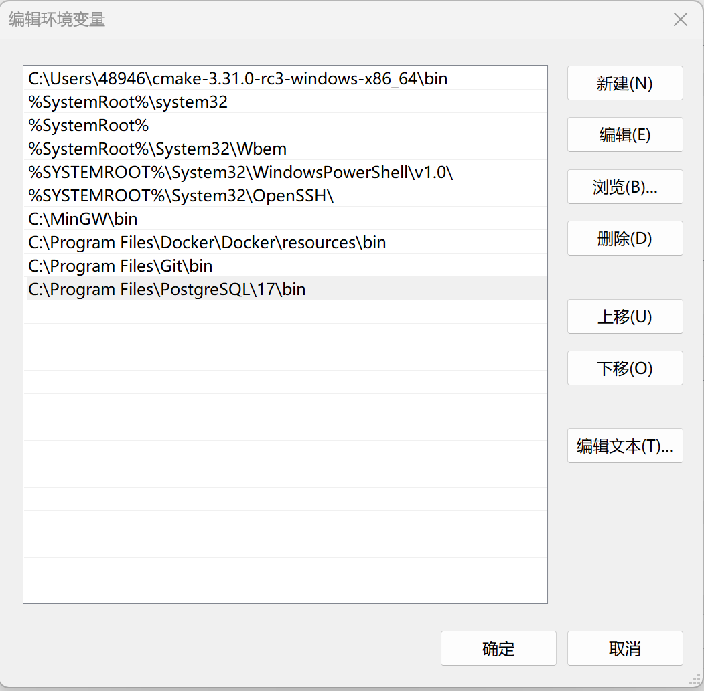
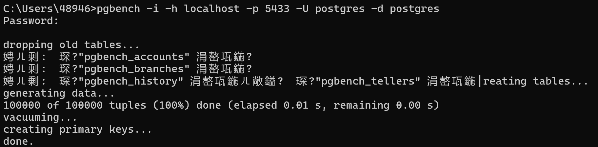

# DB-Project3仓库简介
该仓库为南方科技大学CS213数据库原理(H)课程的Project3项目文件仓库。
目录下/sql文件夹中包含测试所用到的sql脚本文件，
    /initial_data_from_cmd文件夹中包含通过运行pgbench进行测试所得到的输出数据
    /report文件夹中包含项目报告的word文件及导出pdf文件
如有疑问，可联系12311153@mail.sustech.edu.cn

# 项目内容介绍

openGauss 是华为公司开发的开源关系型数据库管理系统 （RDBMS）。它专为企业级应用程序而设计，基于PostgreSQL，具有专为高性能、可靠性和安全性量身定制的增强功能。据称，openGauss 特别适用于复杂的数据密集型场景，例如金融系统、电信和大型电子商务平台。

本实验旨在通过对比PostgreSQL和openGauss的性能探讨和评估 openGauss 的实际应用性能。

## pgbench测试工具
- pgbench简介：
pgbench 是 PostgreSQL 自带的一个基准测试工具， 用于评估数据库的性能。它通过模拟多个并发的数据库会话，反复执行一系列预定义或自定义的 SQL 命令，从而计算事务执行的平均速率（每秒执行的事务个数）。在终端调用pgbench 利用多客户端、多线程执行 SQL 脚本后， pgbench 将会输出每个客户端的事务数、实际处理的事务数、平均延迟时间和每秒的事务数等，能够帮助我恩了解数 据库的性能表现。由于 openGauss 也是基于 PostgreSQL 开发并同时兼容 pgbench，因此 pgbench 非常支持该实验 用来测试 PostgreSQL 和 openGauss 数据库的并发量、吞吐量、延迟等性能指标。

- [在docker上安装Postgres及openGauss](./docx/project3-openGaussGuideline.pdf)
> Reference: CS213课程助教 Ziyang Zhang

- 配置pgbench
0.	环境配置
Postgres的安装包中已带有pgbench工具，在终端运行pgbench，首先需要将Postgres加入环境配置。以Windows11操作系统为例，步骤为：
    1）	win+r打开运行对话框，输入sysdm.cpl，回车后进入系统属性界面
    2）	点击“高级”页面下面的“环境变量”
    3）	点击系统变量下的Path后点击编辑，点击浏览，找到PostgreSQL的文件夹下的bin文件夹，加入到环境变量并确认。

1.	初始化
pgbench -i -h [主机名] -p [端口] -U [用户名称] -d [数据库名称] 

其中，-i -- initialize 表示对资料库初始化  
-p -- port 指代数据库连接的端口
-h -- host 指代数据库连接的主机
-U -- User 指代连接数据库时登录的用户，输入的密码也应当是该用户的对应密码（PostgreSQL默认为postgres；openGauss默认为gaussdb）
-d -- database 指代数据库名称（两者均默认为postgres）

> 以本人在本地测试为例：
> （在PostgreSQL中进行初始化）pgbench -i -h localhost -p 5432 -U postgres -d postgres 
> （在openGauss中进行初始化）pgbench -h localhost -p 15432 -U gaussdb -d postgres -i

回车确认后，需要在输入用户密码。

### 可能遇到的问题
在本人进行初始化过程中，发现反复出现以下报错
- 找不到pgbench_branches

此时注意-i 命令应当在其他命令符前面，pgbench的后面，初始化成功结果如下

- openGauss连接失败

此时注意不同于PostgreSQL，-i 命令符应当在端口（-p）后

- “tid”列名冲突

这是由于“tid”在openGauss中被设置为了系统保留字，想要直接解决难度复杂度均较大。此时我们选用的解决方式为，直接运行测试命令，发现不会影响后续的测试操作。

2.  测试命令

